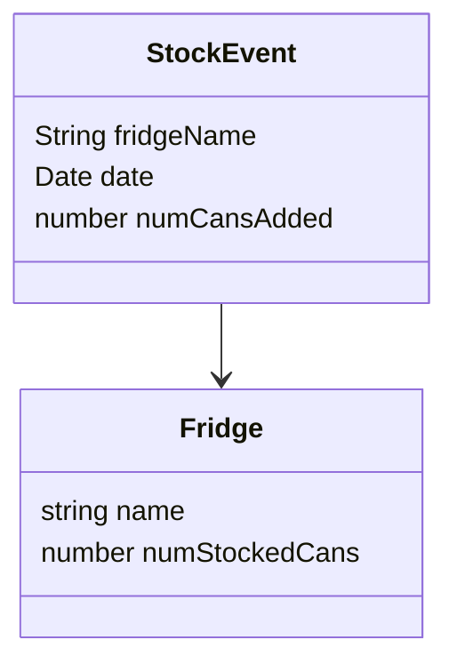

# Cola counter
Storage backend for 'Cola counter' IoT project.

Provides a REST API, a web-interface and an MQTT interface to store and retrieve cola counts.

[Just let me read the code](https://github.com/jyelewis/cola-counter/blob/main/src/modules/fridge/fridge.service.ts)

## Data model

## API
### REST
`GET /healthcheck` - returns "OK" if the server is healthy

`GET /fridges/:fridgeName` - returns a specific fridge, creates it if it doesn't exist

`POST /fridges/:fridgeName/stock-events { numCansAdded: -1 }` - adds/removes cans from a fridge

`GET /fridges/:fridgeName/stock-events` - returns list of recent stock events 

### MQTT
TODO

## Getting started
### Running locally
1. Install [Node.js](https://nodejs.org/en/)
2. Install [Docker](https://www.docker.com/)
3. Run `npm start`
4. API will be available at http://localhost:3000
5. To stop the server, press `Ctrl+C`, to stop third party deps, run `npm stop`

### Deploying to AWS
1. Follow the above steps to install dependencies
2. Ensure you have your AWS CLI configured & authenticated
3. `npm run deploy`
4. Get your API URL from the output of the above command, or AWS Lambda console

## Tech stack

### Cloud infrastructure
 - [AWS Lambda](https://docs.aws.amazon.com/lambda/latest/dg/welcome.html) as compute platform
 - [AWS Lambda Function URLs](https://docs.aws.amazon.com/lambda/latest/dg/lambda-urls.html) as REST API server
 - [AWS CloudFront](https://aws.amazon.com/cloudfront/) as CDN
 - [AWS IoT Core](https://aws.amazon.com/iot-core/) as MQTT interface
 - [AWS DynamoDB](https://aws.amazon.com/dynamodb/) as database

### Language & tools
 - [TypeScript](https://www.typescriptlang.org/)
 - [NestJS](https://docs.nestjs.com/) as project framework
 - [DynamoFlow](https://github.com/jyelewis/dynamoflow) as DynamoDB ORM
 - [Prettier](https://prettier.io/) as code formatter
 - [ESLint](https://eslint.org/) as code linter
 - [Docker](https://www.docker.com/) to run external dependencies locally
